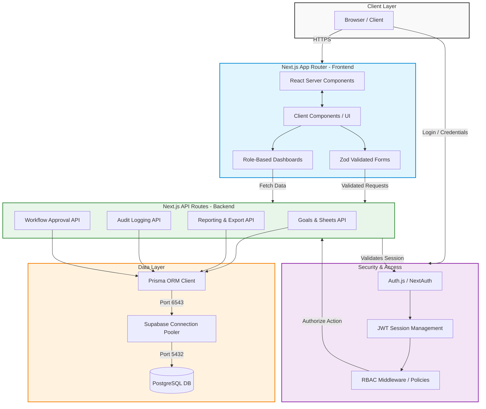
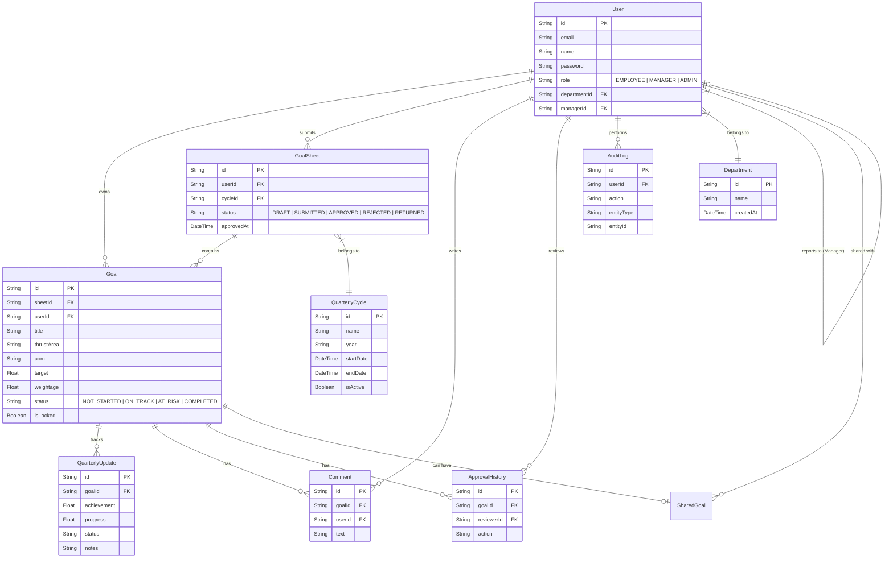
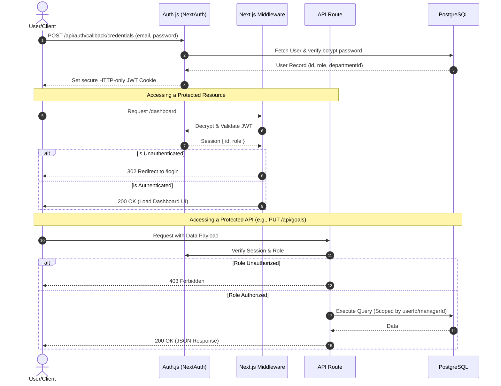
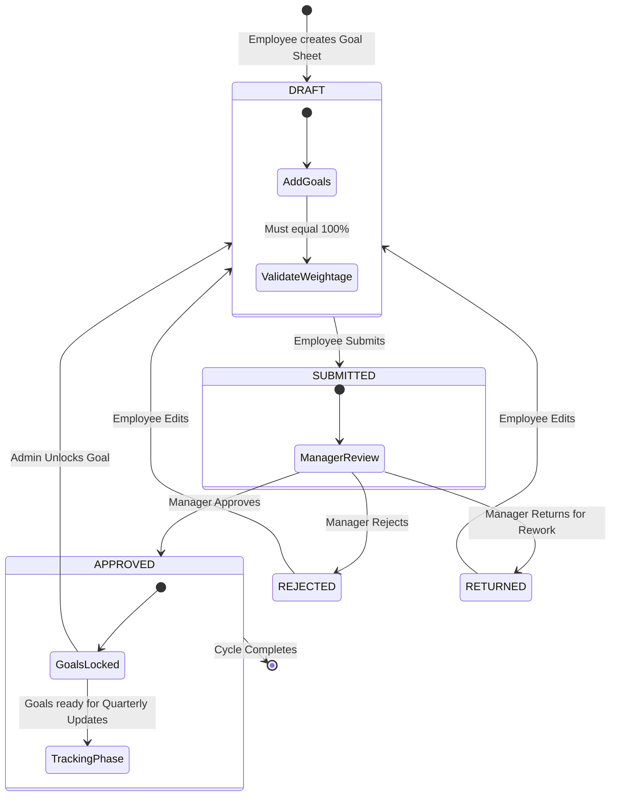
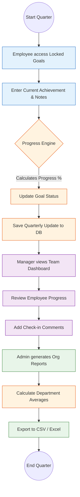

# AtomQuest Architecture & System Design

This document contains the enterprise system architecture diagrams for the AtomQuest platform, detailing the high-level architecture, database schema, authentication flows, and core workflows.

## 1. High-Level System Architecture

---

## 2. Database Entity Relationship Diagram (ERD)

---

## 3. Authentication & RBAC Flow

---

## 4. Goal Approval Workflow

---

## 5. Quarterly Review & Reporting Flow

